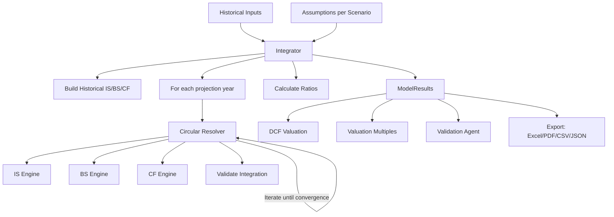

# WOLF 3-Statement Financial Model Engine — Complete Technical Reference

> **Version**: v0.1.0 | **Store Version**: v7 | **Last Updated**: April 2026
> **Framework**: Next.js 16 + React 19 + TypeScript 5 + Zustand 5

---

## Table of Contents

1. [Architecture Overview](#1-architecture-overview)
2. [File Map](#2-file-map)
3. [Type System](#3-type-system)
4. [Income Statement Engine](#4-income-statement-engine)
5. [Balance Sheet Engine](#5-balance-sheet-engine)
6. [Cash Flow Engine](#6-cash-flow-engine)
7. [Circular Reference Resolver](#7-circular-reference-resolver)
8. [Integrator (Master Orchestrator)](#8-integrator-master-orchestrator)
9. [Egyptian Regulatory Compliance](#9-egyptian-regulatory-compliance)
10. [DCF Valuation Engine](#10-dcf-valuation-engine)
11. [Valuation Multiples Engine](#11-valuation-multiples-engine)
12. [Financial Ratios](#12-financial-ratios)
13. [Scenario Management](#13-scenario-management)
14. [Sensitivity Analysis](#14-sensitivity-analysis)
15. [Monte Carlo Simulation](#15-monte-carlo-simulation)
16. [Validation Agent](#16-validation-agent)
17. [Integration Checks (28-Point Suite)](#17-integration-checks-28-point-suite)
18. [Egyptian Depreciation Schedules](#18-egyptian-depreciation-schedules)
19. [State Management (Zustand Store)](#19-state-management-zustand-store)
20. [Historical Data System](#20-historical-data-system)
21. [Export Systems](#21-export-systems)
22. [AI Analyst Service](#22-ai-analyst-service)
23. [Internationalization (i18n)](#23-internationalization-i18n)
24. [Industry Templates](#24-industry-templates)
25. [Utility Functions](#25-utility-functions)
26. [UI Components](#26-ui-components)
27. [Default Assumptions & Market Rates](#27-default-assumptions--market-rates)
28. [Known Limitations](#28-known-limitations)

---

## 1. Architecture Overview

The engine is a **client-side** financial modeling system that runs entirely in the browser. It computes a fully integrated 3-statement model (Income Statement, Balance Sheet, Cash Flow Statement) with circular reference resolution, Egyptian regulatory compliance, DCF valuation, and a 28-point integration validation suite.

### Data Flow



### Key Design Decisions
- **Cash is the balancing plug**: When BS doesn't balance, cash is adjusted
- **Beginning-of-period interest**: Interest expense = beginning debt × rate
- **Convergence tolerance**: 0.01 (monetary units), max 500 iterations
- **FCFF computed on IS as memo**: Not back-solved from CF
- **EPD and Legal Reserve computed independently on Net Income** (not sequentially)

---

## 2. File Map

### Engine Core (`lib/engines/`)

| File | Size | Purpose |
|------|------|---------|
| [income-statement.ts](file:///c:/Users/user/Desktop/3_Statement_Model_Engine/lib/engines/income-statement.ts) | 15KB | IS calculation + tax loss carryforward + profit appropriation |
| [balance-sheet.ts](file:///c:/Users/user/Desktop/3_Statement_Model_Engine/lib/engines/balance-sheet.ts) | 14KB | BS calculation + depreciation + interest helpers |
| [cash-flow.ts](file:///c:/Users/user/Desktop/3_Statement_Model_Engine/lib/engines/cash-flow.ts) | 11KB | CF indirect method + historical back-solve |
| [circular-resolver.ts](file:///c:/Users/user/Desktop/3_Statement_Model_Engine/lib/engines/circular-resolver.ts) | 25KB | Iterative convergence + 28-point integration checks |
| [integrator.ts](file:///c:/Users/user/Desktop/3_Statement_Model_Engine/lib/engines/integrator.ts) | 7KB | Master orchestrator — runs full model |
| [dcf.ts](file:///c:/Users/user/Desktop/3_Statement_Model_Engine/lib/engines/dcf.ts) | 6KB | WACC + DCF valuation via FCFF |
| [valuation.ts](file:///c:/Users/user/Desktop/3_Statement_Model_Engine/lib/engines/valuation.ts) | 5KB | Trading multiples + EGX benchmarks |

### Supporting Logic (`lib/`)

| File | Purpose |
|------|---------|
| [ratios.ts](file:///c:/Users/user/Desktop/3_Statement_Model_Engine/lib/ratios.ts) | 40+ financial ratios, DuPont, Altman Z, break-even |
| [scenarios.ts](file:///c:/Users/user/Desktop/3_Statement_Model_Engine/lib/scenarios.ts) | Scenario definitions (Base/Optimistic/Conservative) |
| [scenario-manager.ts](file:///c:/Users/user/Desktop/3_Statement_Model_Engine/lib/scenario-manager.ts) | CRUD operations for scenarios |
| [sensitivity.ts](file:///c:/Users/user/Desktop/3_Statement_Model_Engine/lib/sensitivity.ts) | One-way and two-way sensitivity analysis |
| [monte-carlo.ts](file:///c:/Users/user/Desktop/3_Statement_Model_Engine/lib/monte-carlo.ts) | Monte Carlo simulation (4 distributions) |
| [store.ts](file:///c:/Users/user/Desktop/3_Statement_Model_Engine/lib/store.ts) | Zustand store v7 with migrations |
| [utils.ts](file:///c:/Users/user/Desktop/3_Statement_Model_Engine/lib/utils.ts) | Currency/number formatting, always English numerals |
| [cash-flow-indirect.ts](file:///c:/Users/user/Desktop/3_Statement_Model_Engine/lib/cash-flow-indirect.ts) | Reconciliation utilities, re-exports CF engine |

### Schedules (`lib/schedules/`)

| File | Purpose |
|------|---------|
| [egyptian-depreciation.ts](file:///c:/Users/user/Desktop/3_Statement_Model_Engine/lib/schedules/egyptian-depreciation.ts) | Egyptian tax depreciation rates (Law 91/2005 Art. 25-26) |

### Validation Agent (`lib/agents/`)

| File | Purpose |
|------|---------|
| [validation-rules.ts](file:///c:/Users/user/Desktop/3_Statement_Model_Engine/lib/agents/validation-rules.ts) | 19 deterministic validation rules |
| [validation-agent.ts](file:///c:/Users/user/Desktop/3_Statement_Model_Engine/lib/agents/validation-agent.ts) | Orchestrator: local checks + optional AI |
| [validation-types.ts](file:///c:/Users/user/Desktop/3_Statement_Model_Engine/lib/agents/validation-types.ts) | Type definitions for validation system |
| [validation-prompt.ts](file:///c:/Users/user/Desktop/3_Statement_Model_Engine/lib/agents/validation-prompt.ts) | System prompt for Claude API audit |
| [multi-scenario-validator.ts](file:///c:/Users/user/Desktop/3_Statement_Model_Engine/lib/agents/multi-scenario-validator.ts) | Cross-scenario validation |

### Services (`lib/services/`)

| File | Purpose |
|------|---------|
| [analyst.ts](file:///c:/Users/user/Desktop/3_Statement_Model_Engine/lib/services/analyst.ts) | Groq-powered AI analyst chat (Llama 3.1 8B) |

### Templates & i18n

| File | Purpose |
|------|---------|
| [egyptian-industries.ts](file:///c:/Users/user/Desktop/3_Statement_Model_Engine/lib/templates/egyptian-industries.ts) | 5 industry templates (Real Estate, FMCG, Telecom, Petrochem, Tourism) |
| [labels.ts](file:///c:/Users/user/Desktop/3_Statement_Model_Engine/lib/i18n/labels.ts) | Bilingual EN/AR labels for all financial line items |

### Type Definitions (`types/`)

| File | Purpose |
|------|---------|
| [assumptions.ts](file:///c:/Users/user/Desktop/3_Statement_Model_Engine/types/assumptions.ts) | `AssumptionSet` + `HistoricalInputs` + defaults |
| [financial.ts](file:///c:/Users/user/Desktop/3_Statement_Model_Engine/types/financial.ts) | IS, BS, CF, Ratios, DCF, Multiples, IntegrationChecks |
| [scenario.ts](file:///c:/Users/user/Desktop/3_Statement_Model_Engine/types/scenario.ts) | Scenario, ModelState, MonteCarlo, Sensitivity types |
| [historical.ts](file:///c:/Users/user/Desktop/3_Statement_Model_Engine/types/historical.ts) | Per-year historical data input + converter |

### Export (`lib/export/`)

| File | Size | Purpose |
|------|------|---------|
| [excel.ts](file:///c:/Users/user/Desktop/3_Statement_Model_Engine/lib/export/excel.ts) | 174KB | Full Excel export with live formulas |
| [pdf.ts](file:///c:/Users/user/Desktop/3_Statement_Model_Engine/lib/export/pdf.ts) | 51KB | PDF export via jsPDF |
| [csv-json.ts](file:///c:/Users/user/Desktop/3_Statement_Model_Engine/lib/export/csv-json.ts) | 9KB | CSV and JSON export |
| [build-calc-sheets.ts](file:///c:/Users/user/Desktop/3_Statement_Model_Engine/lib/export/build-calc-sheets.ts) | 44KB | Hidden `_Calc` sheets for Excel formulas |
| [build-dashboard.ts](file:///c:/Users/user/Desktop/3_Statement_Model_Engine/lib/export/build-dashboard.ts) | 20KB | Excel dashboard sheet |
| [build-scenarios.ts](file:///c:/Users/user/Desktop/3_Statement_Model_Engine/lib/export/build-scenarios.ts) | 26KB | Excel scenario comparison sheet |
| [build-company-info.ts](file:///c:/Users/user/Desktop/3_Statement_Model_Engine/lib/export/build-company-info.ts) | 7KB | Excel company info sheet |

### UI Components (`components/`)

| File | Purpose |
|------|---------|
| Dashboard.tsx | Main dashboard with KPIs |
| ModelPage.tsx | Assumptions editor |
| EgyptianSettings.tsx | Egyptian-specific settings panel |
| HistoricalDataInput.tsx | Per-year historical data entry form |
| HistoricalImportPage.tsx | CSV/JSON import for historical data |
| ScenariosPage.tsx | Scenario management UI |
| SensitivityPage.tsx | Sensitivity analysis UI |
| MonteCarloPage.tsx | Monte Carlo simulation UI |
| ValidationPage.tsx | Validation report display |
| DCFPage.tsx | DCF valuation display |
| ValuationPage.tsx | Trading multiples display |
| RatiosPage.tsx | Financial ratios dashboard |
| CBEMetricsPage.tsx | CBE-linked metrics page |
| AnalystPanel.tsx | AI analyst chat panel |
| Navbar.tsx, Sidebar.tsx | Navigation |
| ScenarioSelector.tsx | Scenario toggle |
| CompanySettings.tsx | Company info editor |
| `statements/` | IS, BS, CF display pages |
| `schedules/` | Debt, Depreciation, Working Capital pages |
| `charts/` | Revenue and Margin charts (Recharts) |

---

## 3. Type System

### AssumptionSet — All Input Parameters

The `AssumptionSet` interface contains **every** adjustable parameter. All per-year arrays are indexed `[Year0, Year1, ..., Year4]` for 5 projection years.

**Revenue**: `revenueBase`, `revenueGrowthRate[]`
**Margins** (% of revenue): `cogsPercent[]`, `sgaPercent[]`, `rdPercent[]`, `otherOpexPercent[]`
**Working Capital** (days): `dso[]`, `dio[]`, `dpo[]`, `prepaidPercent[]`, `accruedExpPercent[]`, `deferredRevPercent[]`
**CapEx/Depreciation**: `capexPercent[]`, `depreciationRate[]`, `amortizationAmount[]`
**Debt**: `cbeRate`, `interestRateOnDebt[]`, `interestRateOnCash[]`, `legacyDebtRate`, `shortTermDebtAmount[]`, `longTermDebtIssuance[]`, `longTermDebtRepayment[]`, `currentPortionLTD[]`
**Equity**: `sharesOutstanding[]`, `dividendPayoutRatio[]`, `shareRepurchaseAmount[]`, `stockBasedCompAmount[]`
**Tax**: `taxRate[]`, `taxRegime` (standard|oil|strategic|sme), `enableTaxLossCarryforward`, `taxLossCarryforwardYears`
**Egyptian**: `employeeProfitSharingRate`, `enableEmployeeProfitShare`, `totalAnnualPayroll`, `enableLegalReserve`, `legalReservePercent`, `paidUpCapital`, `legalReserveCap`, `initialLegalReserve`, `dividendWithholdingTaxRate`, `isEGXListed`, `depreciationMethod`, `assetMix`, `enableEndOfServiceBenefit`
**DCF**: `riskFreeRate`, `terminalGrowthRate`, `equityRiskPremium`, `beta`
**Localization**: `countryPreset`, `vatRate`, `enableVAT`, `fiscalYearEnd`, `fiscalYearPreset`
**Time**: `projectionYears` (default 5), `historicalYears` (default 2), `startYear` (2026)

---

## 4. Income Statement Engine

**File**: `lib/engines/income-statement.ts`

### Projected IS Formula Chain

```
Revenue         = PreviousRevenue × (1 + growthRate[yr])
COGS            = Revenue × cogsPercent[yr]
Gross Profit    = Revenue − COGS
SGA             = Revenue × sgaPercent[yr]
R&D             = Revenue × rdPercent[yr]
Depreciation    = from BS schedule (circular input)
Amortization    = amortizationAmount[yr]    (absolute)
Other OpEx      = Revenue × otherOpexPercent[yr]
SBC             = stockBasedCompAmount[yr]  (absolute)
Total OpEx      = SGA + R&D + Dep + Amort + OtherOpEx + SBC
EBIT            = Gross Profit − Total OpEx
EBITDA          = EBIT + Depreciation + Amortization
Interest Income = from BS schedule (circular input)
Interest Exp    = from BS schedule (circular input)
EBT             = EBIT + Interest Income − Interest Expense + OtherIncomeExpense
Tax Expense     = calculated via tax loss carryforward system
Net Income      = EBT − Tax Expense
```

### Tax Loss Carryforward System

- **FIFO vintage tracking**: Each loss year creates a vintage with an expiry (current year + 5)
- Expired vintages are pruned each year
- When EBT > 0 and carryforward enabled: oldest losses utilized first
- `TaxableIncome = MAX(0, EBT − LossUtilized)`
- `TaxExpense = TaxableIncome × taxRate`
- When EBT ≤ 0: tax = 0, new loss vintage created

### Profit Appropriation Waterfall (Egyptian Law)

Both EPD and Legal Reserve are computed **independently on Net Income**:

```
1. Net Income (already computed)
2. Legal Reserve   = min(NI × 5%, max(0, PaidUpCapital × 50% − cumulativeLR))
   - Stops when cumulative LR reaches 50% of paid-up capital
   - Zero if NI ≤ 0
3. EPD             = max(0, NI × 10%)
   - Capped at totalAnnualPayroll (if > 0)
   - Zero if NI ≤ 0
4. NI After EPD    = NI − EPD
5. Distributable   = NI − EPD − Legal Reserve
6. canPayDividends = distributable > 0 AND previousRE ≥ 0
7. Gross Dividends = canPayDividends ? distributable × payoutRatio : 0
8. Dividend WHT    = grossDividends × (isEGXListed ? 5% : 10%)
9. Net Dividends   = grossDividends − dividendWHT
10. Addition to RE = distributable − grossDividends
```

### Memo Items
```
EffectiveTaxRate = EBT > 0 ? TaxExpense / EBT : statutoryRate
NOPAT           = EBIT × (1 − EffectiveTaxRate)
ΔNWC            = currentNWC − previousNWC
FCFF            = NOPAT + Depreciation + Amortization − CapEx − ΔNWC
EPS             = NI After EPD / SharesOutstanding
```

### Historical IS Builder
- Takes raw arrays and computes all derived fields
- `additionToRE` uses actual BS retained earnings change when available (Fix 8)
- Historical FCFF = 0 (not computed)

---

## 5. Balance Sheet Engine

**File**: `lib/engines/balance-sheet.ts`

### Current Assets
```
Cash                 = endingCashFromCF (or prev.cash on first iteration)
Accounts Receivable  = (DSO × Revenue) / 365
Inventory            = (DIO × COGS) / 365
Prepaid Expenses     = Revenue × prepaidPercent[yr]
Other Current Assets = otherCurrentAssets[yr] ?? prev value
Total Current Assets = sum of above
```

### Non-Current Assets
```
CapEx                    = Revenue × capexPercent[yr]
Gross PP&E               = prev.grossPPE + CapEx
Accumulated Depreciation = prev.accumDepr + IS.depreciation
Net PP&E                 = Gross PP&E − Accumulated Depreciation
Intangibles              = max(0, prev.intangibles − IS.amortization)
Goodwill                 = goodwill[yr] ?? prev value (static)
Other LT Assets          = otherLongTermAssets[yr] ?? prev value
```

### Current Liabilities
```
Accounts Payable        = (DPO × COGS) / 365
Accrued Expenses        = Revenue × accruedExpPercent[yr]
Deferred Revenue        = Revenue × deferredRevPercent[yr]
Short-Term Debt         = shortTermDebtAmount[yr] ?? prev
Current Portion LTD     = currentPortionLTD[yr] ?? prev
Other Current Liab.     = otherCurrentLiabilities[yr] ?? prev
```

### Non-Current Liabilities
```
Long-Term Debt          = prev.LTD + issuance − repayment
Deferred Tax Liab.      = deferredTaxLiabilities[yr] ?? prev (non-circular)
Other LT Liab.          = otherLongTermLiabilities[yr] ?? prev
EOS Provision           = prev.EOS + (avgMonthlySalary/2 × employees[yr])
```

### Equity
```
Common Stock     = commonStock[yr] ?? prev
APIC             = prev.APIC + equityIssuance[yr] + SBC[yr]
Legal Reserve    = priorLR + legalReserveAddition (from IS)
Retained Earnings = prev.RE + IS.additionToRE
Treasury Stock   = prev.treasuryStock − shareRepurchases[yr]
OCI              = oci[yr] ?? prev
Total Equity     = CS + APIC + LR + RE + Treasury + OCI
```

### Balancing Plug
If `|Total Assets − Total L+E| > 0.001`, cash is adjusted:
```
finalCash = cash − rawImbalance
```

### Interest Helpers
```
InterestExpense(beginDebt, endDebt, rate) = beginDebt × rate
InterestIncome(beginCash, endCash, rate)  = beginCash × rate
```

### Depreciation Methods
```
Straight-Line:   avgGrossPPE × rate     where avgGrossPPE = prevGross + capex/2
Egyptian Tax:    Declining balance on NBV per asset class (see §18)
```

---

## 6. Cash Flow Engine

**File**: `lib/engines/cash-flow.ts` — Indirect Method

### Operating Activities
```
Net Income
+ Depreciation
+ Amortization
+ Stock-Based Comp
+ Deferred Taxes           = curr.DTL − prev.DTL
+ Change in AR             = −(curr.AR − prev.AR)
+ Change in Inventory      = −(curr.Inv − prev.Inv)
+ Change in Prepaid        = −(curr.Prepaid − prev.Prepaid)
+ Change in AP             = curr.AP − prev.AP
+ Change in Accrued Exp    = curr.AccrExp − prev.AccrExp
+ Change in Deferred Rev   = curr.DefRev − prev.DefRev
= Cash from Operations
```

### Investing Activities
```
CapEx                = −(Revenue × capexPercent)
Acquisitions         = −acquisitions[yr]
Asset Sales          = assetSales[yr]
Investment Purchases = −investmentPurchases[yr]
Investment Sales     = investmentSales[yr]
= Cash from Investing
```

### Financing Activities
```
Debt Issuance             = longTermDebtIssuance[yr]
Debt Repayment            = −longTermDebtRepayment[yr]
Equity Issuance           = equityIssuance[yr]
Dividends Paid            = −IS.grossDividends
Employee Profit Sharing   = −IS.employeeProfitSharing
Share Repurchases         = −shareRepurchaseAmount[yr]
Dividend WHT              = −IS.dividendWHT (memo line)
= Cash from Financing
```

> [!IMPORTANT]
> `dividendsPaid = −grossDividends` includes both the net amount to shareholders AND the WHT remitted to ETA. The WHT line is a memo decomposition, not a separate cash outflow.

```
Net Change in Cash = CFO + CFI + CFF
Beginning Cash     = prev.BS.cash
Ending Cash        = Beginning + Net Change
Free Cash Flow     = CFO + CapEx (capex already negative)
```

### Historical CF Builder
- Back-solves from period-over-period BS changes
- Dividends = `prev.RE + NI − curr.RE`
- Debt change split into issuance/repayment
- EPD and WHT not retroactively modeled for historical periods

---

## 7. Circular Reference Resolver

**File**: `lib/engines/circular-resolver.ts`

### The Circular Dependency
```
Debt Balance → Interest Expense → Net Income → Retained Earnings → Equity → BS Balance → Cash → Interest Income → ...
```

### Algorithm
1. **Initialize estimates** from previous period's depreciation, interest expense, interest income
2. **Loop** (max 500 iterations, tolerance 0.01):
   a. Calculate IS with current estimates
   b. Calculate BS (first pass, cash = null)
   c. Recalculate IS with actual NWC from BS
   d. Calculate CF
   e. Update BS with CF ending cash
   f. Update depreciation estimate from new PP&E
   g. Update interest expense: `beginDebt × rate`
   h. Update interest income: `beginCash × rate`
   i. Check convergence: `|endingCash − previousEndingCash| < 0.01`
3. **Return** final IS, BS, CF + convergence info + carry-forward state (tax loss vintages, legal reserve)

---

## 8. Integrator (Master Orchestrator)

**File**: `lib/engines/integrator.ts`

### `runFullModel(assumptions, historicalInputs)` → `ModelResults`

1. **Sanitize historical period labels** — count back from `startYear`
2. **Build historical statements** — IS, BS, CF from raw data
3. **Project forward** — for each of `projectionYears` years:
   - Get previous period (historical last or prior projected)
   - Call `resolveCircularReferences()`
   - Carry forward tax loss vintages and legal reserve state
   - Run `validateIntegration()` for 28-point checks
4. **Combine** historical + projected
5. **Calculate ratios** for all periods
6. **Return** `ModelResults`

---

## 9. Egyptian Regulatory Compliance

### Law 159/1981 — Companies Law
- **Art. 40**: Legal Reserve = 5% of NI, capped at 50% of paid-up capital
- **Art. 41**: EPD = 10% of NI, capped at total annual payroll
- **Art. 53**: Dividends blocked if cumulative RE < 0

### Law 91/2005 — Income Tax
- **Standard**: 22.5%
- **Oil Exploration**: 40.55%
- **Strategic / CBE / Suez Canal**: 40.0%
- **Loss Carryforward**: 5 years (Art. 29), FIFO vintage tracking

### Law 6/2025 — SME Turnover Tax
| Revenue Bracket (EGP) | Tax Rate |
|---|---|
| Up to 1,000,000 | 0.40% |
| 1,000,001 – 2,000,000 | 0.75% |
| 2,000,001 – 3,000,000 | 1.00% |
| 3,000,001 – 20,000,000 | 1.50% |

### Law 30/2023 — Dividend WHT
- **EGX-listed**: 5%
- **Unlisted**: 10%

### Labor Law Art. 41 — EPD
- 10% of NI, capped at total annual payroll
- Zero if NI ≤ 0

### EAS 38 — End of Service Benefits
- Provision = (avgMonthlySalary / 2) × numberOfEmployees per year

---

## 10. DCF Valuation Engine

**File**: `lib/engines/dcf.ts`

### WACC Calculation
```
Cost of Equity (CAPM)  = RiskFreeRate + β × EquityRiskPremium
Cost of Debt (after-tax) = DebtRate × (1 − TaxRate)
Capital Weights        = from last projected BS
WACC                   = Equity% × Ke + Debt% × Kd
```

### DCF Valuation
```
FCFF from IS memo items (NOPAT + D&A − CapEx − ΔNWC)
Discounted FCFFs      = FCFF_i / (1 + WACC)^i
Terminal Value         = FCFF_n × (1 + g) / (WACC − g)    [Gordon Growth]
PV Terminal Value      = TV / (1 + WACC)^n
Enterprise Value       = Σ Discounted FCFFs + PV(TV)
Net Debt              = Total Debt − Cash
Equity Value          = EV − Net Debt
Implied Share Price   = Equity Value / Shares Outstanding
```

### Sanity Checks
- WACC ≤ 0 or > 50%
- g ≥ WACC (undefined TV)
- Ke ≤ Kd (unusual risk pricing)
- D/(D+E) > 90%
- TV > 85% of EV
- Negative implied share price

### Egyptian Market Defaults
| Parameter | Default | Source |
|---|---|---|
| Risk-Free Rate | 20.0% | 12-month T-Bill yields |
| Equity Risk Premium | 10.5% | Damodaran Egypt |
| Cost of Debt (pre-tax) | 22.0% | CBE base + corporate spread |
| Terminal Growth | 7.0% | CBE target inflation |
| Interest on Cash | 18.0% | Bank deposit rates |
| CBE Rate | 27.25% | CBE overnight rate |

---

## 11. Valuation Multiples Engine

**File**: `lib/engines/valuation.ts`

### Trading Multiples (requires `sharePrice`)
```
Market Cap        = sharePrice × sharesOutstanding
Enterprise Value  = Market Cap + Net Debt
P/E               = sharePrice / EPS
EV/EBITDA         = EV / EBITDA
Price/Book        = sharePrice / (totalEquity / shares)
FCF Yield         = FCF / Market Cap
Dividend Yield    = DPS / sharePrice
```

### EGX 30 Benchmarks (Q1 2026)
| Multiple | Low | High | Avg |
|---|---|---|---|
| P/E | 8.0x | 15.0x | 11.5x |
| EV/EBITDA | 5.0x | 10.0x | 7.5x |
| P/B | 1.0x | 2.5x | 1.75x |
| Dividend Yield | 2.0% | 7.0% | 4.5% |

### Implied Share Prices
```
From P/E:       EGX_PE_avg × EPS
From EV/EBITDA: (EGX_EVEBITDA_avg × EBITDA − Net Debt) / shares
From P/B:       EGX_PB_avg × BVPS
```

### Sector Working Capital Presets
| Sector | DSO | DIO | DPO |
|---|---|---|---|
| Technology | 45 | 0 | 30 |
| Manufacturing | 60 | 45 | 60 |
| Retail | 15 | 60 | 45 |
| Government Contractor | 90 | 45 | 60 |
| Export-Oriented | 45 | 30 | 30 |
| Real Estate | 180 | 0 | 90 |

---

## 12. Financial Ratios

**File**: `lib/ratios.ts` — 40+ ratios computed per period

### Profitability
| Ratio | Formula |
|---|---|
| Gross Margin | grossProfit / revenue |
| EBITDA Margin | EBITDA / revenue |
| Operating Margin | EBIT / revenue |
| Net Margin | netIncome / revenue |
| ROE | NI / totalEquity (ending) |
| ROA | NI / totalAssets (ending) |
| ROIC | NOPAT / (totalEquity + totalDebt − cash) |

### Liquidity
| Ratio | Formula |
|---|---|
| Current Ratio | TCA / TCL |
| Quick Ratio | (TCA − Inventory) / TCL |
| Cash Ratio | Cash / TCL |

### Leverage
| Ratio | Formula |
|---|---|
| D/E | totalDebt / totalEquity |
| D/A | totalDebt / totalAssets |
| Interest Coverage | EBIT / interestExpense |
| Net Debt | totalDebt − cash |
| Net Debt/EBITDA | netDebt / EBITDA |
| DSCR | EBITDA / (interestExpense + 20,000) |

### Efficiency
| Ratio | Formula |
|---|---|
| Asset Turnover | revenue / totalAssets |
| Inventory Turnover | COGS / avgInventory |
| Receivables Turnover | revenue / avgAR |
| DSO | (AR / revenue) × 365 |
| DIO | (inventory / COGS) × 365 |
| DPO | (AP / COGS) × 365 |
| Cash Conversion Cycle | DSO + DIO − DPO |
| FCF Margin | FCF / revenue |
| FCF/EBITDA | FCF / EBITDA |

### Per Share
| Metric | Formula |
|---|---|
| EPS | NI After EPD / shares |
| BVPS | totalEquity / shares |
| FCF/Share | FCFF / shares |
| Revenue/Share | revenue / shares |

### DuPont Analysis
```
3-Factor: ROE = Net Margin × Asset Turnover × Equity Multiplier
5-Factor: ROE = Tax Burden × Interest Burden × Op Margin × Asset Turnover × Equity Multiplier
  Tax Burden      = NI / EBT
  Interest Burden = EBT / EBIT
```

### Altman Z-Score
```
Z' (Private): 0.717×X1 + 0.847×X2 + 3.107×X3 + 0.420×X4 + 0.998×X5
  X1 = WC / TA, X2 = RE / TA, X3 = EBIT / TA, X4 = Equity / Debt, X5 = Revenue / TA
  Safe > 2.90, Grey 1.23–2.90, Distress < 1.23

Z_EM (Emerging): 6.56×X1 + 3.26×X2 + 6.72×X3 + 1.05×X4
  (No X5 — revenue/assets omitted)
  Safe > 2.60, Grey 1.10–2.60, Distress < 1.10
```

### Break-Even Analysis
```
Variable Cost Ratio    = COGS / Revenue
Contribution Margin    = 1 − Variable Cost Ratio
Fixed Costs            = SGA + Dep + Amort + Other OpEx + SBC + R&D
Break-Even Revenue     = Fixed Costs / Contribution Margin Ratio
Margin of Safety       = (Revenue − BER) / Revenue
Operating Leverage     = Contribution Margin / EBIT
```

---

## 13. Scenario Management

### Pre-defined Scenarios

| Scenario | Revenue Growth | COGS% | SGA% |
|---|---|---|---|
| **Base** | 10%, 8%, 7%, 6%, 5% | 60% flat | 15% flat |
| **Optimistic** | 15%, 12%, 10%, 9%, 8% | 55%→51% | 13%→11% |
| **Conservative** | 3%, 2%, 2%, 1%, 1% | 65%→68% | 18%→20% |

### Global Settings Sync
When `calculateAllScenarios()` runs, these keys sync from Base → all scenarios:
`taxRate`, `taxRegime`, `vatRate`, `enableVAT`, `projectionYears`, `cbeRate`, `riskFreeRate`, `interestRateOnDebt`, `interestRateOnCash`, `employeeProfitSharingRate`, `enableLegalReserve`, `depreciationMethod`, and more.

### Custom Scenarios
Users can create custom scenarios via `addScenario()` or `duplicateScenario()`. Each scenario stores its own `AssumptionSet` and `ModelResults`.

---

## 14. Sensitivity Analysis

**File**: `lib/sensitivity.ts`

### One-Way
Varies a single assumption across a range, re-runs full model for each value, returns output metric.

### Two-Way
Creates an N×M matrix varying two assumptions simultaneously.

### Output Metrics
`revenue`, `ebitda`, `netIncome`, `eps`, `fcf`, `roe`, `interestCoverage`

---

## 15. Monte Carlo Simulation

**File**: `lib/monte-carlo.ts`

### Distributions
- **Normal**: Box-Muller transform
- **Uniform**: min + random × (max − min)
- **Triangular**: inverse CDF method
- **Lognormal**: exp(Normal)

### Default Config
| Variable | Distribution | Parameters |
|---|---|---|
| revenueGrowthRate | Normal | μ=18%, σ=8% |
| cogsPercent | Normal | μ=60%, σ=5% |
| interestRate | Uniform | [22%, 28%] |

- **Default iterations**: 10,000
- **Output metrics**: netIncome, fcf, eps
- **Statistics**: mean, median, stdDev, P10/P25/P50/P75/P90, min, max

---

## 16. Validation Agent

**File**: `lib/agents/validation-agent.ts`

### Architecture
1. **Phase 1 (Local)**: 19 deterministic rules run instantly, for free
2. **Phase 2 (AI)**: Optional Claude API call for deeper analysis (only if local fails)
3. **Merge + Deduplicate** findings

### 19 Validation Rules

**Tier 1 — Critical** (Block export)
| # | Rule |
|---|---|
| 1 | Balance Sheet must balance (TA = TL+E) |
| 2 | CF Ending Cash = BS Cash |
| 3 | Revenue chain integrity (R_t = R_{t-1} × (1+g)) |
| 4 | Net Income math (EBT − Tax = NI) |
| 6 | EPD = max(0, NI × 10%) |
| 7 | Legal Reserve addition formula |
| 8 | Distributable = NI − EPD − LR |
| 9 | Gross Dividends = Distributable × payout ratio |
| 10 | Dividend WHT = Gross × WHT rate |
| 11 | Addition to RE = Distributable − Gross Dividends |
| 12 | RE roll-forward (RE_t = RE_{t-1} + AddToRE) |
| 13 | Tax = max(0, EBT × taxRate) |
| 15 | CF Net Change = CFO + CFI + CFF |
| 16 | Ending Cash = Beginning + Net Change |

**Tier 2 — Major**
| # | Rule |
|---|---|
| 17 | NOPAT = EBIT × (1 − taxRate) |
| 20 | EBITDA = EBIT + D + A |
| 26 | ROIC formula |
| 27 | ROE formula |
| 28 | ROA formula |

**Tier 3 — Advisory**
| # | Rule |
|---|---|
| 31 | EPD zero in loss years |
| 32 | LR zero in loss years |
| 33 | LR cap enforcement |
| 37 | Revenue growth deceleration check |
| 38 | Negative FCF warning |

---

## 17. Integration Checks (28-Point Suite)

**File**: `lib/engines/circular-resolver.ts` → `validateIntegration()`

Run after each projected year. All use tolerance = 0.01.

| # | Check | Formula |
|---|---|---|
| 1 | BS Balance | TA = TL+E |
| 2 | Cash Ties | BS.cash = CF.endingCash |
| 3 | NI Flow | IS.NI = CF.NI |
| 4 | PP&E Ties | curr.grossPPE = prev.grossPPE + |CapEx| |
| 5 | RE Roll | curr.RE = prev.RE + IS.additionToRE |
| 6 | Debt Ties | curr.LTD = prev.LTD + issuance + repayment |
| 7 | CF Reconcile | netChange = CFO + CFI + CFF |
| 8 | WC Ties | BS WC changes = CF WC items |
| 9 | TCA Sum | Cash + AR + Inv + Prepaid + OCA |
| 10 | NCA Sum | NetPPE + Intangibles + GW + OLA |
| 11 | TCL Sum | AP + AccrExp + STD + CPLTD + DefRev + OCL |
| 12 | NCL Sum | LTD + DTL + OLTL + EOS |
| 13 | Equity Sum | CS + APIC + LR + RE + Treasury + OCI |
| 14 | NI Waterfall | Revenue − all expenses = NI |
| 15 | EBITDA Identity | EBIT + D + A |
| 16 | APIC Consistency | ΔAPIC = SBC + Equity Issuance |
| 17 | EPD Calc | Self-referential check |
| 18 | NI After EPD | NI − EPD |
| 19 | Distributable | NI − EPD − LR |
| 20 | Dividends ≤ Distributable | grossDivs ≤ max(0, distributable) |
| 21 | Net Dividends | gross − WHT |
| 22 | Addition to RE | distributable − grossDividends |
| 23 | NOPAT | EBIT × (1 − effective rate) |
| 24 | LR Roll | prev.LR + LR addition |
| 25 | Tax Loss Utilized ≤ Carryforward | |
| 26 | Taxable Income | max(0, EBT − lossUtilized) |
| 27 | CF Dividends = IS Dividends | |
| 28 | CF WHT = IS WHT | |

---

## 18. Egyptian Depreciation Schedules

**File**: `lib/schedules/egyptian-depreciation.ts`

### Tax Law 91/2005, Articles 25-26 — Declining Balance on NBV

| Asset Class | Arabic | Rate |
|---|---|---|
| Buildings & Structures | مباني | 5% |
| Machinery & Equipment | آلات ومعدات | 25% |
| Vehicles & Transport | سيارات ووسائل نقل | 25% |
| Computers & IT | أجهزة حاسب آلي | 50% |
| Furniture & Fixtures | أثاث وتجهيزات | 20% |

### Calculation
```
depreciableBase = previousNetPPE + capex
For each asset class:
  classBase = depreciableBase × assetMix[class]
  depreciation[class] = classBase × legalRate[class]
totalDepreciation = Σ depreciation[class]
```

### Default Asset Mix
Buildings 30%, Machinery 35%, Vehicles 15%, Computers 10%, Furniture 10%

### Straight-Line Alternative
```
avgGrossPPE = previousGrossPPE + capex / 2
depreciation = avgGrossPPE × rate
```

---

## 19. State Management (Zustand Store)

**File**: `lib/store.ts` — Version 7

### Persisted State
`companyName`, `ticker`, `industry`, `currency`, `country`, `fiscalYearEnd`, `valuationDate`, `historicalData`, `historicalInputs`, `scenarios`, `activeScenarioId`, `isDarkMode`

### Store Migrations (v2 → v7)
| Version | Migration |
|---|---|
| v2 | Scalar `interestRate` → per-year `interestRateOnDebt[]` |
| v3 | Default new fields: `cbeRate`, `legacyDebtRate`, `riskFreeRate`, etc. |
| v4 | Force-sync taxRate to match taxRegime; reset US-default interest rates to Egyptian; update startYear 2025→2026 |
| v5 | Fix erroneous tax rates < 10% → reset to 22.5% |
| v6 | Fix historical period label double-migration bug |
| v7 | Force recalculation for new ratio fields (ebitdaMargin, netDebt, dscr, etc.) |

### Key Actions
- `calculateModel()` — single active scenario
- `calculateAllScenarios()` — all scenarios with global settings sync
- `setCountryPreset('egypt')` — applies Egyptian defaults to all scenarios
- `runValidation()` — auto-runs after calculation
- `undo()/redo()` — 50-entry stack, tracks assumption changes

---

## 20. Historical Data System

**File**: `types/historical.ts`

### Per-Year Format (`HistoricalDataInput`)
Each historical year is a flat object with ~60 fields covering IS + BS. The `buildHistoricalYear()` helper:
- Computes gross profit, EBIT, EBT, net income
- Computes all BS subtotals
- **Retained earnings = plug** (TA − TL − other equity)

### Converter
`convertToHistoricalInputs(data[])` → `HistoricalInputs` (array format for engine)

### Default Data
2 years: 2024 and 2025, with balanced balance sheets.

---

## 21. Export Systems

### Excel (`lib/export/excel.ts` — 174KB)
- Full workbook with live formulas
- Hidden `_Calc_Base`, `_Calc_Opt`, `_Calc_Con` sheets
- Presentation tabs reference `_Calc` via `IF(Dashboard!Scenario=...)` formulas
- Styled with dark theme, gold accents
- Uses `exceljs` library

### PDF (`lib/export/pdf.ts` — 51KB)
- Landscape A4 via `jsPDF` + `jspdf-autotable`
- All three statements + ratios + DCF

### CSV/JSON (`lib/export/csv-json.ts`)
- JSON includes all derived fields, metadata (exportDate, companyName, currency)
- CSV export for tabular data

---

## 22. AI Analyst Service

**File**: `lib/services/analyst.ts`

- **Provider**: Groq API (Llama 3.1 8B Instant)
- **System prompt**: CFA-grade financial analyst for Egyptian market
- **Context**: Compact summary of IS/BS/CF with Egyptian profit waterfall
- **Features**: RE roll-forward verification, BS balance check, CF reconciliation

---

## 23. Internationalization (i18n)

**File**: `lib/i18n/labels.ts`

Bilingual labels (English/Arabic) for all financial line items: IS (39 items), BS (31 items), CF (7 items), Ratios (5 items), Egyptian-specific (9 items), DuPont (4 items), Altman (1 item), Break-Even (3 items).

---

## 24. Industry Templates

**File**: `lib/templates/egyptian-industries.ts`

| Industry | Growth | Gross Margin | SGA | DSO | DIO | DPO | CapEx |
|---|---|---|---|---|---|---|---|
| Real Estate | 15% | 35% | 8% | 90 | 60 | 75 | 3% |
| FMCG | 12% | 30% | 12% | 30 | 45 | 40 | 5% |
| Telecom | 10% | 55% | 15% | 35 | 5 | 50 | 15% |
| Petrochemicals | 8% | 25% | 6% | 45 | 30 | 45 | 8% |
| Tourism | 18% | 45% | 20% | 15 | 10 | 25 | 6% |

---

## 25. Utility Functions

**File**: `lib/utils.ts`

| Function | Purpose |
|---|---|
| `formatCurrency(value, currency, compact)` | Format with symbol, always EN numerals (`en-US` locale) |
| `formatPercent(value, decimals)` | `× 100` + `%` |
| `formatNumber(value, decimals)` | Intl.NumberFormat EN-US |
| `formatEPS(value, currency)` | Currency symbol + 2 decimals |
| `colorForValue(value)` | Green/red/neutral CSS vars |
| `cn(...classes)` | Class name combiner |
| `formatFiscalYear(year, fyEnd)` | `FY2024` or `FY2024/25` |

### Supported Currencies
USD ($), EGP (EGP), EUR (€), GBP (£), SAR (SR), AED (AED)

---

## 26. UI Components

### Navigation
- **Navbar**: Top bar with company name, calculate buttons, export dropdown
- **Sidebar**: 18 navigation tabs organized by category

### Pages (18 tabs)
`dashboard`, `model`, `income`, `balance`, `cashflow`, `scenarios`, `sensitivity`, `montecarlo`, `import`, `historicaldata`, `working-capital`, `depreciation`, `debt-schedule`, `validation`, `company-settings`, `dcf`, `valuation`, `ratios`, `cbe-metrics`

### Charts
- `RevenueChart.tsx` — Revenue bar chart (Recharts)
- `MarginChart.tsx` — Margin line chart (Recharts)

---

## 27. Default Assumptions & Market Rates

### Egyptian Market Defaults (March 2026)

| Parameter | Value | Source |
|---|---|---|
| Corporate Tax Rate | 22.5% | Law 91/2005 |
| VAT Rate | 14% | — |
| Dividend WHT (unlisted) | 10% | Law 30/2023 |
| Dividend WHT (EGX) | 5% | Law 30/2023 |
| CBE Overnight Rate | 27.25% | CBE |
| Interest on Debt (Y1-Y5) | 22%, 22%, 20%, 18%, 18% | CBE + spread |
| Interest on Cash (Y1-Y5) | 22%, 20%, 18%, 16%, 15% | Bank deposits |
| Risk-Free Rate | 20% | T-Bill yields |
| Equity Risk Premium | 10.5% | Damodaran Egypt |
| Terminal Growth | 7% | CBE target inflation |
| EPD Rate | 10% | Labor Law Art. 41 |
| Legal Reserve Rate | 5% | Companies Law Art. 40 |
| Legal Reserve Cap | 50% of paid-up capital | Art. 40 |
| Tax Loss Carryforward | 5 years | Art. 29 |
| Inflation Path | 25%, 18%, 14%, 10%, 8% | Egyptian CPI |

### Default Historical Data (2024–2025)
| Metric | 2024 | 2025 |
|---|---|---|
| Revenue | 850,000 | 950,000 |
| COGS | 510,000 | 570,000 |
| Net PP&E | 212,000 | 225,000 |
| Cash | 175,000 | 200,000 |
| LT Debt | 230,000 | 210,000 |

---

## 28. Known Limitations

| Area | Limitation |
|---|---|
| Circular References | May not converge with extreme assumptions (200%+ debt ratios) |
| Interest Calculation | Beginning-of-period flat rate — no mid-period debt changes |
| Balancing Plug | Cash adjusted when BS doesn't balance exactly |
| Goodwill & Intangibles | Static — no impairment testing |
| SBC | Fixed amount, not revenue-linked |
| Working Capital | DSO/DIO/DPO-driven — no seasonal variation |
| Debt Structure | No automatic covenants or refinancing |
| Monte Carlo | 10,000+ iterations can freeze UI for 5-15 seconds |
| PDF Export | May truncate columns with 8+ projected years |
| Browser Storage | localStorage limited to ~5MB |
| Undo/Redo | Only tracks assumption changes |
| Multi-User | Single-user only — no collaboration |

### Planned Improvements
- Web Worker for Monte Carlo
- Debt covenants and revolving credit facility
- Real-time API integration (Yahoo Finance, FMP)
- Multi-currency support
- Industry-specific templates expansion
